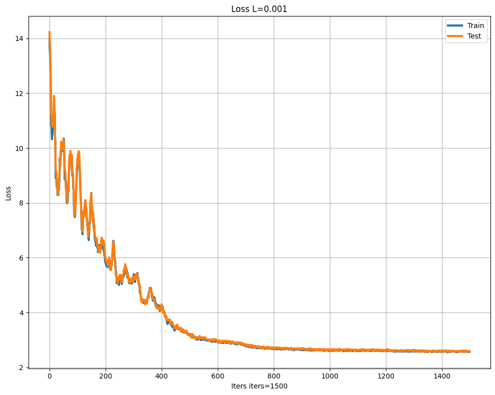
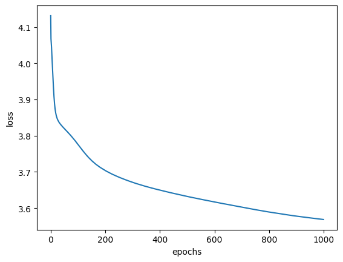
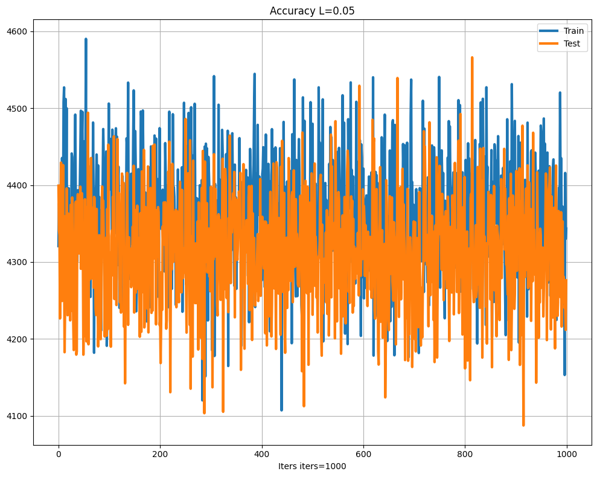

# Predicción de notas de piano con redes neuronales

Tres redes neuronales que intentan adivinar la próxima nota de una interpretación de piano a partir de las 100 anteriores. Dos las programé desde cero en NumPy y la tercera, en TensorFlow, sirve de control. Es el trabajo práctico final de Matemática III de la Tecnicatura en Programación Informática (UNSAM), que hicimos en equipo de dos personas en 2024.

## Problema que resuelve

La consigna pedía diseñar, entrenar y evaluar una red neuronal escribiendo toda la matemática a mano: forward propagation, backpropagation y descenso por gradiente estocástico, sin frameworks de deep learning.

Elegimos un problema de secuencias: dada una melodía, predecir qué nota viene después. Usamos el dataset [MAESTRO v2.0.0](https://magenta.tensorflow.org/datasets/maestro), que tiene unas 200 horas de interpretaciones de piano en MIDI (1282 archivos).

El desafío técnico estuvo en dos lugares:

- Derivar e implementar el backpropagation de cada arquitectura, incluida la derivada de softmax combinada con entropía cruzada.
- Decidir cómo representar una nota. Si la tratás como un número del 0 al 127, la red hace regresión y el error se mide en semitonos de distancia. Si la tratás como una clase, pasa a ser un problema de clasificación con muchas categorías.

## Demo

Los notebooks se pueden abrir en Colab y ya tienen guardadas las salidas de la última ejecución, así que se pueden leer sin correrlos.

| Notebook | Modelo | Abrir |
|---|---|---|
| [TP_Mate_RNN.ipynb](TP_Mate_RNN.ipynb) | Red en NumPy, salida sigmoide (regresión) |  |
| [TP_Mate_RNN_softmax.ipynb](TP_Mate_RNN_softmax.ipynb) | Red en NumPy, salida softmax (12 clases) |  |
| [TP_Mate_RNN_Tensorflow.ipynb](TP_Mate_RNN_Tensorflow.ipynb) | Red en Keras, salida softmax (128 clases) |  |

**Modelo softmax en NumPy.** Pérdida (entropía cruzada) en train y test durante 1500 iteraciones, con tasa de aprendizaje 0,001 y momentum 0,9. Pasa de 23,3 antes de entrenar a 2,59.

**Modelo de control en TensorFlow.** Pérdida durante 1000 épocas, con tasa de aprendizaje 0,05. Pasa de 4,95 a 3,57.

**Modelo base en NumPy.** Error cuadrático medio en train y test durante 1000 iteraciones, con tasa de aprendizaje 0,05. Se queda oscilando alrededor de 4300 y no baja.

Resultados que quedaron guardados en los notebooks:

| Modelo | Clases posibles | Resultado final | Referencia |
|---|---|---|---|
| Base (NumPy, sigmoide) | regresión sobre 0–127 | error cuadrático medio ≈ 4300 (unos 65 semitonos de error típico) | igual que antes de entrenar |
| Softmax (NumPy) | 12 | loss 2,59, accuracy en test 9,2% | adivinar al azar da 8,3% |
| Control (TensorFlow) | 128 | loss 3,57, accuracy 8,8% | adivinar al azar da 0,8% |

## Tecnologías

- **Python** en **Google Colab**
- **NumPy** para las dos redes hechas a mano: pesos, forward, backpropagation y SGD
- **pretty_midi** para leer los archivos MIDI
- **pandas** y **tf.data** para armar las ventanas de 100 notas
- **scikit-learn** solo para separar train y test (`train_test_split`)
- **TensorFlow / Keras** para el modelo de control
- **Matplotlib** para los gráficos

## Cómo funciona

1. **Datos.** Cada notebook descarga MAESTRO v2.0.0, lee algunos archivos MIDI (2 en el modelo base, 3 en el softmax y 20 en el de TensorFlow) y se queda solo con la altura (pitch) de cada nota, ordenada por tiempo de inicio. Duración y velocidad quedan afuera.
2. **Ventanas.** La secuencia se corta en ventanas deslizantes de 101 notas: las primeras 100 son la entrada, normalizadas entre 0 y 1, y la última es la nota a predecir.
3. **Modelo base.** Tiene 100 entradas, 60 neuronas ocultas con leaky ReLU y 1 salida con sigmoide que se multiplica por 128 para llevarla al rango de notas MIDI. Entrena con SGD de a una muestra por vez.
4. **Modelo softmax.** Cada nota se reduce a su clase de altura (`nota % 12`: do, do#, re…, sin importar la octava) y la salida pasa a 12 neuronas con softmax. Usa entropía cruzada como pérdida y SGD con momentum.
5. **Modelo de control.** En Keras: 100 entradas, 110 neuronas ocultas con ReLU y 128 salidas con softmax (una por nota MIDI). Usa entropía cruzada categórica y SGD en lotes de 100.

Las decisiones que tomé y por qué:

- **Implementar la red en NumPy, sin frameworks.** El objetivo de la materia era entender la matemática. Por eso la derivada de cada capa está escrita a mano en `backward_prop`.
- **Separar train y test una sola vez, con semilla fija, antes de entrenar.** Así todas las pruebas con distintas tasas de aprendizaje usan los mismos datos y los resultados se pueden comparar.
- **Pasar de regresión a clasificación.** En el modelo base el error no bajaba: la sigmoide trata la nota como un número continuo. Con softmax la red devuelve una probabilidad por clase y la respuesta es la más probable.
- **Usar un modelo en TensorFlow como control.** Una implementación probada nos daba una referencia para saber si los números de nuestra red eran razonables o si había un error en el código.

Un dato para leer los resultados: si la red reparte la probabilidad en partes iguales entre 12 clases, la entropía cruzada da ln(12) ≈ 2,48. La pérdida final del modelo softmax (2,59) queda muy cerca de ese valor y su accuracy (9,2%) apenas supera el azar. El modelo de TensorFlow, en cambio, acierta unas 11 veces más que el azar sobre 128 notas.

## Cómo correrlo

La forma más directa es Colab: abrí un notebook con el botón de [Demo](#demo) y ejecutá todas las celdas. Las primeras celdas instalan las dependencias y descargan el dataset (59 MB).

Tené en cuenta:

- Los notebooks se ejecutaron en 2024 con Python 3.10 y TensorFlow 2.15, que era lo que tenía Colab en ese momento. TensorFlow 2.15 necesita Python 3.9 a 3.11.
- El entrenamiento del modelo de TensorFlow tardó 45 minutos en Colab.

## Qué aprendí y qué mejoraría

**Qué aprendí**

- Cómo se deriva el backpropagation capa por capa y cómo se traduce a productos de matrices en NumPy.
- Que la forma de representar el dato cambia el problema: una nota como número lleva a una regresión con error cuadrático y una nota como clase lleva a una clasificación con softmax y entropía cruzada.
- A leer una métrica en contexto. Una pérdida o un accuracy solo dicen algo cuando los comparás con lo que daría adivinar al azar.
- A preparar datos secuenciales: leer archivos MIDI y cortarlos en ventanas deslizantes de entrada y salida.

**Qué mejoraría**

- Arreglar el reinicio de pesos entre tasas de aprendizaje. `w_h_test = w_hidden` no copia el arreglo, solo apunta al mismo, así que cada tasa sigue entrenando desde donde terminó la anterior y la comparación entre tasas no es limpia.
- Comparar desde el principio contra una referencia simple, como el azar o la clase más frecuente. Sin eso, un accuracy del 9% no dice si la red aprendió algo.
- Hacer la red parametrizable en cantidad de capas, neuronas y función de activación, y sumar una comparación contra scikit-learn.
- Sacar a un módulo común la carga de MIDI y el armado de ventanas, que hoy están repetidos en los tres notebooks.

## Autoría y mejoras

Este repositorio es el original del trabajo práctico final que hicimos en equipo entre mayo y junio de 2024. El tag [`tp-original-2024`](https://github.com/solalcaraz/TP-MATEIII-RN/tree/tp-original-2024) marca el TP tal como lo entregamos.

**Equipo:** María Sol Alcaraz y Damián Palomba.

**Mi parte en la versión original**:

- Creé el repositorio y armé el notebook del modelo base.
- Agregué el gráfico de evaluación y ordené el manejo de variables del entrenamiento en el modelo base.
- Ajusté los tres notebooks durante el desarrollo.
- Pasé el modelo softmax de 128 notas a 12 clases de altura.
- Escribí el README original y subí los gráficos de resultados.

**Lo que hice después**:

- Reescribí el README con el problema, las decisiones técnicas, los resultados y cómo correrlo.
- Actualicé los gráficos del README para que coincidan con los resultados guardados en los notebooks. El gráfico del modelo softmax que estaba antes correspondía a una versión anterior, con 128 clases, y el de TensorFlow era una captura de pantalla.
- Agregué los botones para abrir cada notebook en Colab.
- Marqué la versión entregada con el tag `tp-original-2024`.